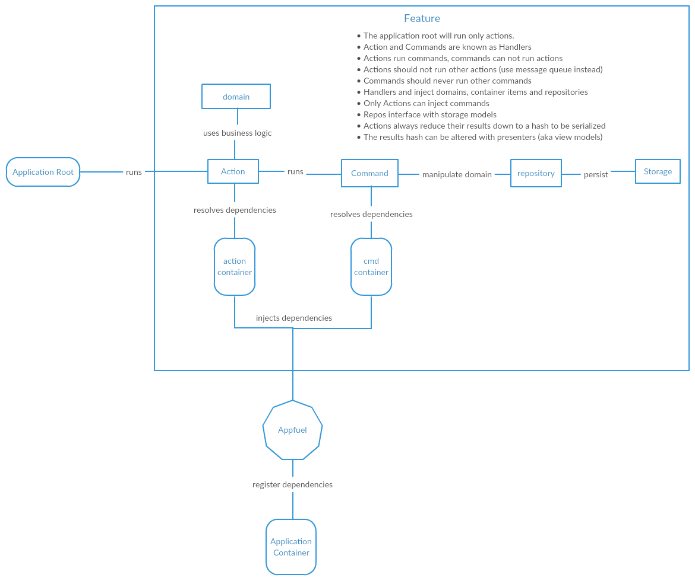

[](https://travis-ci.org/rsb/appfuel)
[](https://codeclimate.com/github/rsb/appfuel)
[](https://codeclimate.com/github/rsb/appfuel/coverage)
[](https://codeclimate.com/github/rsb/appfuel)

# Appfuel
Appfuel is a library that employs a set of conventions and patterns used to separate your business code from the API framework in which it lives, while providing a consistent interface for your api code to interact with it. The idea is that your business code should live isolated in its own gem making the api boundary, your rails app for example, just another client..


## Installation

Add this line to your application's Gemfile:

```ruby
gem 'appfuel'
```

And then execute:

    $ bundle

Or install it yourself as:

    $ gem install appfuel

## Overview
Appfuel exists to solve two problems, aligning application boundaries & code scalability.

### Application Boundaries
We align our application boundaries by isolating our business logic into its own gem and exposing a set of interfaces to interact with that logic. Your ruby app (web, console, daemon) would represent its own boundary that simply interacted with your business gem. It would do this by declaring the business gem as dependency it needs to use and treating it like any other gem. As a result, we establish a standard set of inputs that always deliver a predictable output.

### Code Scalability
We address the issue of how well code scales by using object oriented design principles, mainly, `single point of responsibility`. This however, creates an illusion, instead of having a small number of very large files, we produce a large number of smaller files. While we have more files, they are simpler to read and mentally reason their intent.

We also tackle complexity using `dependency inversion` where we build all of our dependencies into an application container and rely on the fact that every dependency can be found using a key that will resolve to that particular dependency.

We will cover the basic here, more detailed docs can be found on our [gitbook](https://rsb.gitbooks.io/appfuel/).

## Architecture


## Directory Structure, Ruby Namespaces & the Application Container
This is not required but we assume your are moving your business code behind a `rubygem` and as such you should be following [rubygems guidelines](http://guides.rubygems.org/patterns/). From the gem's `lib` we usually declare the root module as the gem module. For example for a gem named `FooBar` we have a lib director that looks like:
```
$ ls
foo_bar/ foo_bar.rb
```

We loosely follow the guideline that directories match namespaces, however to try and prevent overly long namespaces where we can, we sometimes break with this guideline.

All Appfuel dependencies are registered into a dependency injection (Inversion of Control IoC) container. There are two general types of dependencies:

1. Classes
    - `Actions`, `Commands`, `Repositories` & `Domains`
    - Auto register with container using its ruby namespace with a few rules.
    - Container Key Rules:
        - the root namespace is never in the key, it is the name of the container
        - the module directly under the root is either `global` or `the name of a feature module`
            - ex) `FooBar::Global::Search` => `global.actions.search`
            - ex) `FooBar::Users::Search` => `features.users.actions.search`

2. Blocks defined from a DSL
    - `initializers`, `validators`, `domain builders` & `presenters`
    - register with container via DSL.
    - DSL handles registration key

## Setting Up Appfuel
In order to use Appfuel we mixin `Appfuel::Application::Root` into our `application root class` and configure it as follows:

```ruby
module FooBar
  extend Appfuel::Application::Root

  setup_appfuel root: self,
                root_path: File.dirname(__FILE__),
                config_definition: Configuration.definition,
                on_after_setup: ->(_container) {
                  require_relative 'foo_bar/initializers'
                }

end
```

1. Mixin the application root to allow us to use `setup_appfuel` and `call`
    - `call` with run any action with a route of format `feature/action`
2. `setup_appfuel` allows `appfuel` configure & initialize your system
    - `root`: is the root module, its name with be the name of the `app_container`
    - `root_path`: allows appfuel to auto load features
    - `config_definition`: is a Dsl that setups configuration data
    - `on_after_setup`: is a hook that will call your lambda once setup is done

After `setup_appfuel` is called the application container named `foo_bar` is initialized and ready. To retrieve the container from `appfuel`:

```ruby
Appfuel.app_container('foo_bar')
```

Since there are no other app container this is also the default container so you can simply call:
```ruby
Appfuel.app_container
```
This is will return the same container as above.


## Development

After checking out the repo, run `bin/setup` to install dependencies. Then, run `rake spec` to run the tests. You can also run `bin/console` for an interactive prompt that will allow you to experiment.

To install this gem onto your local machine, run `bundle exec rake install`. To release a new version, update the version number in `version.rb`, and then run `bundle exec rake release`, which will create a git tag for the version, push git commits and tags, and push the `.gem` file to [rubygems.org](https://rubygems.org).

## Contributing

Bug reports and pull requests are welcome on GitHub at https://github.com/[USERNAME]/appfuel. This project is intended to be a safe, welcoming space for collaboration, and contributors are expected to adhere to the [Contributor Covenant](http://contributor-covenant.org) code of conduct.

